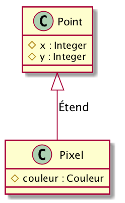
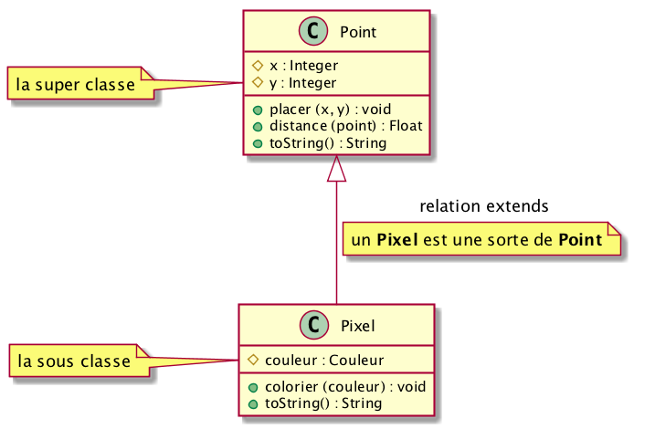
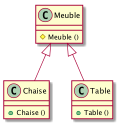
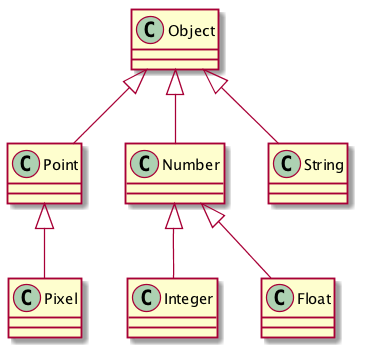
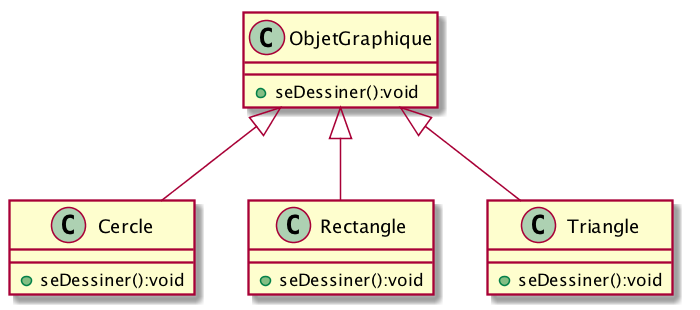
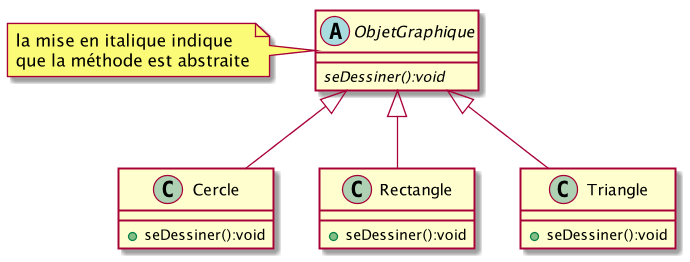

class: center, middle

# Les IHM et le langage Java
### Henri GARRETA & Cyril PAIN-BARRE & Sébastien NEDJAR (MCF AMU) 

---

# À propos
- Sébastien NEDJAR (@nedseb)


---

# À propos
- Sébastien NEDJAR (@nedseb)
    + Maître de conférences au Département Info de l'IUT  d'Aix. Enseignant spécialiste des Bases de données et chercheur en OLAP Mining au LIF.

    + Membre fondateur du Fab Lab Provence et du Laboratoire d'Aixpérimentation et de Bidouille.
    
    + Co-animateur de l'ICSTUG #iutagile.

    + Co-Organisateur des rencontres Beyond Lab.
    
    + Et bien d'autres activités étranges (pour avoir plus de détails faire une psychanalyse d'un étudiant m'ayant subi).
---

class: center, middle

# Cours 2: Java et l'héritage
---

# Héritage : la problématique

- Une classe est extension d'une autre (réutilisation)

.center[]
---

# Héritage : la problématique

- Plusieurs classes ont une partie commune (abstraction)


.center[]

---

# Héritage

- Mécanisme pour définir une nouvelle classe comme extension d'une classe préexistante.

- Tous les membres de la classe préexistante sont membres de la nouvelle classe.

- Dans l'exemple précédent, un objet `Pixel` est une sorte de `Point`.

- Un `Point` devrait pouvoir être substituable par un `Pixel` dans n'importe quelle expression. 

---

# Héritage

Fichier `Point.java` : 
```java
public class Point {
	private int x; 
	private int y;
	
	public void placer(int x, int y) {
		this.x = x;
		this.y = y;
	}
...
}
```

Fichier `Pixel.java` : 
```java
public class Pixel extends Point {
	private Couleur couleur;
	
	public void colorier(Couleur couleur) {
		this.couleur = couleur;
	}
	...
}
```
---

# Héritage
- Mécanisme pour définir une nouvelle classe comme extension d'une classe préexistante.

- Tous les membres de la classe préexistante sont membres de la nouvelle classe.

- Dans l'exemple précédent, un objet `Pixel` est une sorte de `Point`.

- Un `Point` devrait pouvoir être substituable par un `Pixel` dans n'importe quelle expression. 

```java
Point point = new Point();
point.placer(15, 30);

Pixel pixel = new Pixel();
pixel.placer(10, 20);
pixel.colorier(Couleur.rouge);
```
---


# Héritage : Vocabulaire
.center[]
---

# Héritage
- Pas de contrainte-surprise dans un héritage :
  - la super-classe n'a pas à être
  
  - ni dans le même package
  
  - ni dans le même dossier
  
  - ni disponible sous forme de source

- Héritage de l'état : les objets de la sous-classe possèdent toutes les données membres de la super-classe

- Héritage du comportement : tout ce qu'un objet de la super-classe sait faire, un objet de la sous-classe sait le faire aussi.
---

# Héritage
```java
Point point1 = new Point();
point1.placer(15, 30);

Point point2 = new Point();
point2.placer(30, 15);

Pixel pixel1 = new Pixel();
pixel1.placer(10, 20);
pixel1.colorier(Couleur.rouge);

Pixel pixel2 = new Pixel();
pixel2.placer(20, 10);
pixel2.colorier(Couleur.vert);


// Toutes les expressions ci-dessous sont légitimes

float distance1 = point1.distance(point2);
float distance2 = pixel1.distance(point2);
float distance3 = point1.distance(pixel2);
float distance4 = pixel1.distance(pixel2);
```
---

# Héritage et constructeurs
- La construction d'une instance de la sous-classe commence par la construction de sa partie héritée.

- En clair : qu'on le veuille ou non, pour initialiser un `Pixel` il faut commencer par l'initialiser en tant que `Point`.

- Si on ne fait rien, java insère au début de chaque constructeur de la sous-classe un appel du constructeur sans argument de la super-classe

- **Problème** : et si un tel constructeur ne convient pas ou n'existe pas ?

---

# Héritage et constructeurs
- Constructeur problématique : 
    ```java
    class Pixel extends Point {
        private Color couleur;
        public Pixel(int x, int y, Couleur couleur) {
            // ici se cache un appel implicite de Point()
            this.x = x;
            this.y = y;
            this.couleur = couleur;
        }
        ...
    }
    ```

- le constructeur `Point()` existe-t-il ?

- si `Point()` existe, `x` et `y` sont-ils accessibles dans `Pixel` ? (probablement non)

- même si `Point()` existe et `x` et `y` sont accessibles, double initialisation maladroite.
---

# Héritage et constructeurs
- Solution : 
    ```java
    class Pixel extends Point {
        private Color couleur;
        public Pixel(int x, int y, Couleur couleur) {
            super(x, y);
            this.couleur = couleur;
        }
        ...
    }
    ```
- cela se lit : pour initialiser un `Pixel` avec `x`, `y` et `couleur`, commencez par l'initialiser en tant que `Point` avec `x` et `y`, puis donnez à la donnée membre `couleur` la valeur `couleur`

- l'expression `super(...);` doit être la première instruction d'un constructeur.

- elle indique au compilateur quel constructeur de la super classe appeler au début de la création de l'objet.

---

# Héritage et droits d’accès
- `protected` : permission intermédiaire entre `private` et `public`.

- idée : l'auteur d'une sous-classe a plus de droits que le commun des mortels.

- exemple : le constructeur d'une classe qui ne doit pas avoir d'instances directes.

.center[]

---

# Héritage et droits d’accès
Fichier `Meuble.java` : 
```java
public class Meuble {
    
    protected  Meuble() {
        //...
    }
...
}
```

Fichier `Table.java` : 
```java
public class Table extends Meuble {
    
    public Table() {
        Super();
        //...
    }
...
}
```
---

# Surcharge et redéfinition

- un membre de la super-classe a le même nom qu'un membre de la sous-classe s'il s'agit : 

  - d'une variable et une méthode, ou

  - de deux méthodes de signatures différentes ces membres coexistent (mécanisme habituel de la **surcharge**)

- s'il s'agit de deux variables ou de deux méthodes de même signature :

  - le membre de la sous-classe **masque** celui de la super-classe

  - s'il s'agit de deux variables, c'est généralement une maladresse

  - s'il s'agit de deux méthodes de même signature : on appelle cela une **redéfinition** de la méthode et... c'est extrêmement utile !

---

# Cas des méthodes : la surcharge
```java

class Point {
    ...
    void deplacer(int dx, int dy) {
        //changement de la position du point
    }
}

class Pixel extends Point {
    ...
    void deplacer(Couleur couleur) {
        //changement de la couleur du pixel
    }
}

...
int u = 10, v = 100;
Couleur w = Couleur.rouge;
Pixel pixel = new Pixel(...);

pixel.deplacer(u, v); //appel de deplacer hérité de Point

pixel.deplacer(w); //appel de deplacer définie dans Pixel
```

---
# Cas des méthodes : la redéfinition

- si une méthode de la sous-classe a la même signature (nom et arguments) qu'une méthode de la super-classe : la méthode est **redéfinie**.

- justification : puisque la sous-classe *raffine* la super-classe, certaines méthodes de la super-classe y ont une version *raffinée*.

- ou : les objets de la sous-classe savent faire tout ce que savent faire les objets de la super-classe, mais pour certains traitement ils les font "mieux" exemple (classique) :
  - la méthode `toString()` pour un Point : "(10,20)"

  - la méthode `toString()` pour un Pixel : "(10,20) : Rouge"
---

# Cas des méthodes : la redéfinition
Fichier `Point.java` : 
```java
public class Point {
    private int x; 
    private int y;
    
    public String toString() {
        return "(" + x + "," + y + ")";
    }
...
}
```
--
Fichier `Pixel.java` : 
```java
public class Pixel extends Point {
    private Couleur couleur;
    ...
    public String toString() {
        return "(" + x + "," + y + ") : " + couleur; 
        // ERREUR DE COMPILATION : x et y sont privés
    }
    ...
}
```
---

# Cas des méthodes : la redéfinition
Fichier `Point.java` : 
```java
public class Point {
    protected int x; // Changement de visibilité
    protected int y; // Changement de visibilité
    
    public String toString() {
        return "(" + x + "," + y + ")";
    }
...
}
```
--
Fichier `Pixel.java` : 
```java
public class Pixel extends Point {
    private Couleur couleur;
    ...
    public String toString() {
        return "(" + x + "," + y + ") : " + couleur; 
        // Beurk !!! On est obligé de violer l'intimité d'un Point pour l'afficher
        // Ceci est passible de mort dans certains pays
    }
    ...
}
```
---

# Cas des méthodes : la redéfinition
Fichier `Point.java` : 
```java
public class Point {
    private int x; 
    private int y;
    
    public String toString() {
        return "(" + x + "," + y + ")";
    }
...
}
```

--
Fichier `Pixel.java` : 

```java
public class Pixel extends Point {
    private Couleur couleur;
    ...
    public String toString() {
        return super.toString()+" : " + couleur; 
        // Délégation de l'affichage de la partie Point 
        // d'un Pixel à la super classe.
    }
    ...
}
```
---

# Cas des méthodes : la redéfinition
- Pour éviter de confondre surcharge et redéfinition, on peut indiquer explicitement au compilateur que l'on fait une redéfinition avec l'annotation `@Override`.

- Si jamais on se trompe involontairement, le compilateur lèvera une erreur.

--

Fichier `Pixel.java` : 
```java
public class Pixel extends Point {
    private Couleur couleur;
    ...

    @Override
    public String toString() {
        return super.toString()+" : " + couleur; // Juste parfait !
    }
    ...
}
```
---

# `this` et `super` : résumé

- dans une méthode d'instance on peut employer :

  - `this` : l'objet à travers lequel on aura appelé la méthode

  - `super` : le même objet, mais considéré comme ayant pour type la super-classe de son type

- de plus, si cette méthode est un constructeur, on a droit à : 

  - `this(...)` : un appel d'un autre constructeur de la même classe

  - `super(...)` : un appel d'un constructeur de la super-classe
  
  mais uniquement en première ligne du constructeur en question
---

# Polymorphisme : généralisation

Affectation vers une super-classe : 
```java
Pixel pixel = new Pixel(10, 20, Color.RED);
Point point = pixel;
...
```
--
La généralisation est : 
 - implicite

 - toujours légitime

 - sans risque

 - sans travail
---

# Polymorphisme : Particularisation
Affectation vers une sous-classe
```java
void uneMethode(Point point) {
    Pixel pixel = (Pixel) point;
    ...
}
```
--
La particularisation est

  - jamais implicite : *"cast operator"* **obligatoire**

  - pas nécessairement légitime

  - risquée (sous la responsabilité du programmeur), mais contrôlée

  - sans travail
---

# Polymorphisme : hiérarchie des classes

- La `Object`, est la seule qui n'a pas de super-classe.

- Certaines classes ont une super-classe explicite

- Les classes sans super-classe explicite ont `Object` pour super-classe

- L'ensemble de toutes les classes forme une arborescence de racine `Object`

.center[]

---

# Généricité basée sur le polymorphisme
- Avant la version 5, Java ne supportait pas la généricité. Pour proposer une "quasi généricité", le langage 
  s'appuyait sur le polymorphisme et sur la classe `Object`.

- Par exemple, pour définir une collection (conteneurs de donnée comme la classe `Vector` de C++), on définissait 
  en se basant uniquement sur le type le plus général (générique ?).

- exemple : la classe `Stack` (pile) :

```java
public class Stack {
    public boolean empty(){
        /* Teste si la pile est vide */
    }

    public void push(Object item){
        /* Empile l'objet indiquée */
    }

    public Object pop(){
    /* Enlève et renvoie l'objet au sommet de la pile */
    }
    ...
}
```
---

# Généricité basée sur le polymorphisme

- Utilisation de la pile : un programme crée des points, les exploite une fois en les
empilant, puis une autre fois en les dépilant.

- déclaration et initialisation de la pile
 ```java
 Stack pile = new Stack();
 ```

- empilement des points
 ```java
 for (int i = 0; i < n; i++) {
     Point point = new Point();
     ... // exploitation de point
     pile.push(point); // Généralisation
 }
 ```

- dépilement des points
 ```java
 while (!pile.empty()) {
     Point point = (Point) pile.pop(); //Particularisation
     ... // exploitation de point
 }
 ```
---

# Problème de cette "quasi généricité"

- Comme tous les types peuvent être généralisé en `Object`, on pourrait mettre des objets sans liens dans la même pile.

- La particularisation étant de la responsabilité du programmeur, c'est à lui qu'il incombera d'être certain que son transtypage est licite.

- Potentiellement, dès qu'une collection est passée à un tiers (code dont on a pas la maîtrise), il devient impossible d'être certain de la bonne utilisation.

- Toutes ces erreurs de particularisation n'ont lieu qu'à l'exécution.

- depuis Java 5, les classes génériques ont changé la donne. En introduisant la possibilité de typer plus fortement une collection. 
---

# Classes-enveloppes des types primitifs
- Les types primitifs ne sont pas dans l'arbre des classes. Comment les faire passer pour des objets (par exemple dans les collections) ?

- les classes-enveloppes permettent de "déguiser en objets" les valeurs de types primitifs :
 
  `Byte`, `Short`, `Integer`, `Long`, `Float`, `Double`, `Character`, `Boolean`

- principaux membres (par exemple, pour `Integer`) :
 ```java
 int unInt;
 Integer unInteger;
 unInteger = new Integer(unInt); //emballage
 unInt = unInteger.intValue(); // déballage
 ```

- Depuis Java 5, emballage et déballage sont automagiques. On peut écrire :
 ```java
 unInteger = unInt; // sera transformé en unInteger = new Integer(unInt) 
 unInt = unInteger; // sera transformé en unInt = unInteger.intValue()
 ```
---
# Polymorphisme & méthodes virtuelles
L'exemple magique :
.center[]

---
# Polymorphisme & méthodes virtuelles
L'exemple magique :
```java
 class ObjetGraphique {
    public void seDessiner() {
        ...
    }
 }
 class Triangle extends ObjetGraphique {
    @Override
    public void seDessiner() {
        //opérations pour dessiner un triangle
    }
 }
 class Cercle extends ObjetGraphique {
    @Override
    public void seDessiner() {
        //opérations pour dessiner un cercle
    }
 }
 class Rectangle extends ObjetGraphique {
    @Override
    public void seDessiner() {
        //opérations pour dessiner un rectangle
    }
 }
```
---

# Polymorphisme & méthodes virtuelles

- Une image est un tableau d'objets graphiques

- Déclaration
 ```java
 ObjetGraphique[] image = new ObjetGraphique[n];
 ```
- Construction
 ```java
 image[0] = new Triangle(...);
 image[1] = new Cercle(...);
 image[2] = new Rectangle(...);
 ...
 ```

- Affichage 
 ```java
    for (int i = 0; i < n; i++){
        image[i].seDessiner();
    }
 ```
---

# Méthodes abstraites
- Reprenons l'exemple «magique» : 
```java
    class ObjetGraphique {
        public void seDessiner() {
            System.out.println("ERREUR");
        }
    }
    class Triangle extends ObjetGraphique {
    ...
```
- Utilisation : 
```java
    ObjetGraphique og;
    og = new Triangle(...);
    og.seDessiner();
```
- Quelle erreur traduit l'affichage de «ERREUR» ?

- Ne serait-il mieux de la signaler à la compilation ?

---

# Méthodes abstraites
- méthode abstraite : méthode "promise".

 il est nécessaire de la déclarer dans une classe alors qu'elle ne sera définie que dans les sous-classes.

- dans la classe `ObjetGraphique` au lieu de :
 ```java
    public void seDessiner(){
        //code destiné à ne pas servir
    }
 ```
--

 on écrit plutôt : 
 
 ```java
    public abstract void seDessiner();
 ```
---

# Méthodes abstraites

- **idée** : classe qui représente seulement une partie d'une « vraie » classe 

- **techniquement** : une classe qui ne doit pas avoir d'instance

- **exemple** : il est obligatoire de déclarer abstraite une classe qui contient des méthodes abstraites : 
--

 ```java
    public abstract class ObjetGraphique {
        ...
        public abstract void seDessiner();
        ...
    }
 ```
---

# Méthodes abstraites

- **idée** : classe qui représente seulement une partie d'une « vraie » classe 

- **techniquement** : une classe qui ne doit pas avoir d'instance

- **exemple** : il est obligatoire de déclarer abstraite une classe qui contient des méthodes abstraites : 

.center[]
---

# Méthodes abstraites : Récapitulons

- une méthode (ordinaire) représente un service : 

 « voici comment mes instances effectuent un certain traitement »

- une méthode abstraite représente une promesse : 

 « mes instances sauront effectuer un certain traitement, mais on dira comment plus tard (quand on aura plus de détails)».

- une classe abstraite mélange services rendus et promesses à tenir :

 Avant d'en créer des instances il faut définir des sous-classes où toutes les méthodes abstraites sont définies.
---

# Classes et méthodes abstraite
Ce n'est pas parce qu'une méthode est abstraite qu'on ne peut pas l'appeler
immédiatement. Exemple :
```java
public abstract class ObjetGraphique {

    private Couleur couleur;

    public abstract void seDessiner();

    public void sEffacer() {
        couleur = couleurOpposee(couleur);

        seDessiner();

        couleur = couleurOpposee(couleur);
    }
    ...
}
```
---
# Interfaces

- Une interface est une sorte de classe « purement » abstraite, *i.e.* faite de : 
  - méthodes publiques abstraites

  - variables publiques statiques finales (des constantes de classe)

  - tous ces membres sont implicitement `public abstract` (les méthodes) ou `public static final` (les variables)
- Comme les classes abstraite, une interface ne s'instancie pas.

- Une interface est une liste de promesses (contrat, cahier des charges, spécification,...)

- Lorsqu'une classe « tient » les promesses d'une interface on dit que la classe *implémente* l'interface.

---
# Interfaces

- Une classe peut implémenter plusieurs interfaces.

- Les interfaces peuvent hériter les unes des autres.

- la relation d'héritage ( « est une sorte de ») se note : 

  - entre deux classes ou deux interfaces : `extends`

  - entre une classe et une interface : `implements`

- Certaines interfaces (par exemple `Clonable`, `Serializable`) sont totalement vides. Elles servent de "balisage" 
pour reconnaître les types possédant certaines propriétés.

- Depuis Java 8, une interface peut disposer de méthodes `static` et d'implémentations par défaut pour les méthodes publiques.

---
# Classes anonymes
- Situation : on a une classe [resp. une interface] et il nous en faut une sous-classe [resp. une implémentation] destinée 
à être utilisé que dans un seul endroit du code.

- Exemple : un objet `Repondeur` est censé savoir dire Oui et Non :
 ```java
    public interface Repondeur {
        void direOui();
        void direNon();
    }
 ```
--
- En voici une implémentation adaptée à la langue allemande :
 ```java
    Repondeur rep = new Repondeur() {
        public void direOui() {
            System.out.println("Ja");
        }

        public void direNon() {
            System.out.println("Nein");
        }
    };
```
---

# Classes anonymes

- Les classes anonymes sont des classes comme les autres mis à part que par commodité d'écriture elles sont définies et instanciées en une seule opération.

- N'ayant pas de nom, elle ne peuvent pas avoir de méthodes ou variables statiques.

- Elles peuvent avoir accès aux variables locales (et paramètres) visibles dans son bloc de définition à condition qu’elles soient déclarées final.

- Pratique pour implémenter une interface (ou étendre une classe) ayant peu de méthode, elles deviennent rapidement assez illisible.

- À utiliser avec parcimonie car elles peuvent finir par alourdir terriblement le code.
 
---
# Conclusion


